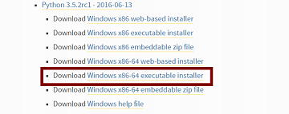
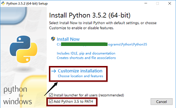
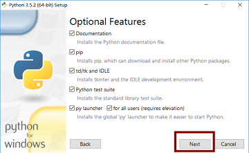
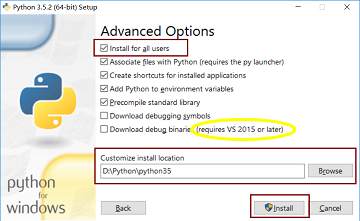
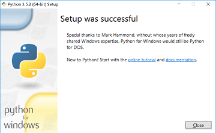
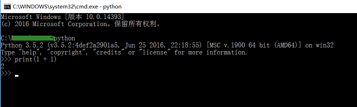
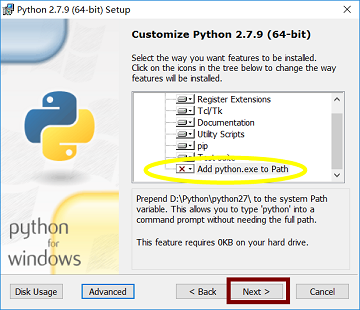
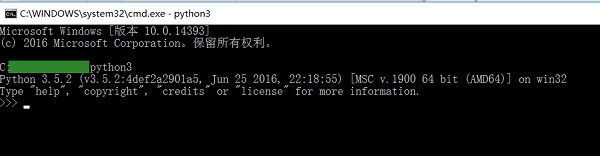
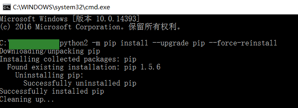

# Windows环境

> **特别说明**，本文是在 **Windows64 位系统**下进行的，32 位系统请下载相应版本的安装包，安装方法类似。

## 下载python安装包

　　进入 python 官网，链接 [https://www.python.org/](https://www.python.org/)

　　选择 Downloads--->Windows，点击进入就可以看到寻找想要的 python 版本

　　​​

　　本文选择的是：

　　Python3.5.2, 点击后面链接可直接下载，[https://www.python.org/ftp/python/3.5.2/python-3.5.2rc1-amd64.exe](https://www.python.org/ftp/python/3.5.2/python-3.5.2rc1-amd64.exe)

　　

　　Python2.7.9, 点击后面链接可直接下载，[https://www.python.org/ftp/python/2.7.9/python-2.7.9.amd64.msi](https://www.python.org/ftp/python/2.7.9/python-2.7.9.amd64.msi)

　　

## python3 安装

> **说明:** 本文先安装 python3，然后安装 python2

　　首先选择安装目录，本文安装路径为 D:\Python\python35，然后点击下载好的 python3 软件包进行安装，具体流程如下：

1. 在下图红色标记的地方 Add Python3.5 to PATH 前勾选，可以直接将 python3 添加到系统环境变量，然后在 Customize installation 中自定义安装路径。
   
2. 直接 next 即可
   
3. 下图中 Advanced Options 中没有默认勾选的根据自己的需要进行勾选，黄色标记为 VS 2015 及其以后版本需要的，如果你以后打算在 VS 2015 中配置 python 环境请勾选此项，点击 Browse 选择安装目录，然后点击 Install 进行安装。
   
4. 等待如下安装过程
   
5. 安装成功
   
6. 点击关闭，查看 python3 安装情况，按 “Win + R” 快捷键，在打开的 “运行” 对话框中，输入 “cmd” 按回车，进入如下界面，输入 python 查看 python3 安装情况，显示 python 3.5.2 的版本信息，则安装成功，可以输入语句 print(1 + 1)进行测试。
   

## python2 安装

1. 点击 python2 安装包，点击运行，next，选择安装目录，本文安装路径为 D:\Python\python27，然后 next
   
2. 下图黄色圈出的部分，显示不能够添加路径到系统变量，不能够直接使用 python 命令没有关系，先点击 next 进行安装，后面专门解决。
   
   
3. 点击 finish 完成安装。
   至此，python2 和 python3 安装完毕。

> 特别说明：此时运行 “cmd” 命令进入 DOS 命令提示框，输入 python 仍然显示 python3 版本。

## 配置环境变量

　　打开，控制面板 \ 系统和安全 \ 系统，选择高级系统设置，环境变量，选择 Path，点击编辑，新建，分别添加 D:\Python\python27 和 D:\Python\python27\Scripts 到环境变量。

> **注意：** python3 安装时可以选择自动添加到系统环境变量，如未选择，方法和 python2 添加过程相同。

## 重命名 python.exe

1. 找到 python2 和 python3 的安装目录，修改 python2.7.9 和 python3.5.2 中 python.exe 和 pythonw.exe 的名称为 python2.exe、pythonw2.exe 和 python3.exe、pythonw3.exe。
2. 然后在运行 cmd 命令，输入 python2 即可运行 python2.7.9 版本
   
3. 输入 python3 即可运行 python3.5.2 版本
   
4. 至此，python2 和 python3 安装完毕。

## pip2 和 pip3 设置

1. Python 安装包需要用到包管理工具 pip，但是当同时安装 python2 和 python3 的时候，pip 只是其中一个版本，以下将提供一个修改方式，即重新安装两个版本的 pip，使得两个 python 版本的 pip 能够共存。
   
2. 在 DOS 命令框输入命令，python2-m pip install --upgrade pip --force-reinstall，显示重新安装成功。
   
3. 现在可以通过 pip2 -V 和 pip3-V 查看两个版本的 pip 信息，以后只需运行 pip2 install XXX 和 pip3 install XXX 即可安装各自的 python 包。
   
4. 至此，pip2 和 pip3 修改成功。
